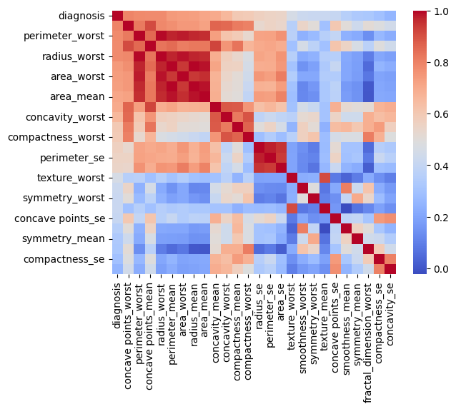
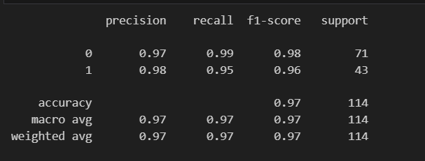
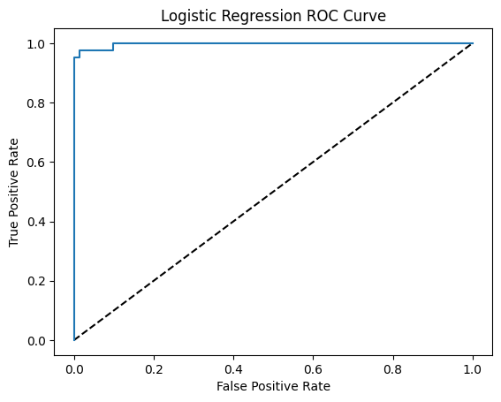

# 📌 Project: Breast Cancer Classification with Model Selection & Hyperparameter Tuning  

## 📖 Overview  
This project builds a **machine learning pipeline** to classify breast cancer tumors as **Malignant (M)** or **Benign (B)** using the **Breast Cancer Wisconsin dataset**.  
The pipeline evaluates multiple classification models, applies **hyperparameter tuning**, and selects the **best-performing model** based on cross-validation accuracy.  

---

## 🚀 Key Features  
- **Data Preprocessing**:
  - Label encoding for categorical target variable (`diagnosis` → 0 for Benign, 1 for Malignant).  
  - Feature scaling using `StandardScaler`.  

- **Model Comparison**:  
  Trained and evaluated the following models:
  1. Logistic Regression ✅ *(Best Model — 97.58% CV Accuracy)*  
  2. Random Forest Classifier  
  3. XGBoost Classifier  

- **Hyperparameter Tuning**:
  - Used `GridSearchCV` to find the best parameters for each model.  
  - Evaluated models using 5-fold cross-validation.

- **Automatic Best Model Selection**:
  - The model with the highest CV accuracy is stored in a variable `best_model` for direct predictions.

---

## 📊 Final Results  
- **Best Model:** Logistic Regression  
- **Cross-validation accuracy:** 97.58%  
- **Best Hyperparameters:**  
  ```python
  {
      'clf__solver': 'lbfgs',
      'clf__penalty': 'l2',
      'clf__C': 1
  }
## 🔥 Model Evaluation Visuals
- 
- 
- 

## 🛠Technologies Used
- python

- Pandas, NumPy

- Scikit-learn

- XGBoost

- Matplotlib / Seaborn

## 📂 How to Run
### Clone repository
```comand
git clone https://github.com/omarelnabawi/Breast-Cancer.git
cd Breast-Cancer

### Create virtual environment
python -m venv env
source env/bin/activate   # On Windows: env\Scripts\activate

### Install dependencies
pip install -r requirements.txt

### Run script
python Breast_cancer.py
```
## 🎯 Goal
The goal of this project is to compare different classification models with optimized hyperparameters, understand feature relationships with diagnosis, and choose the best model for accurate breast cancer prediction.


